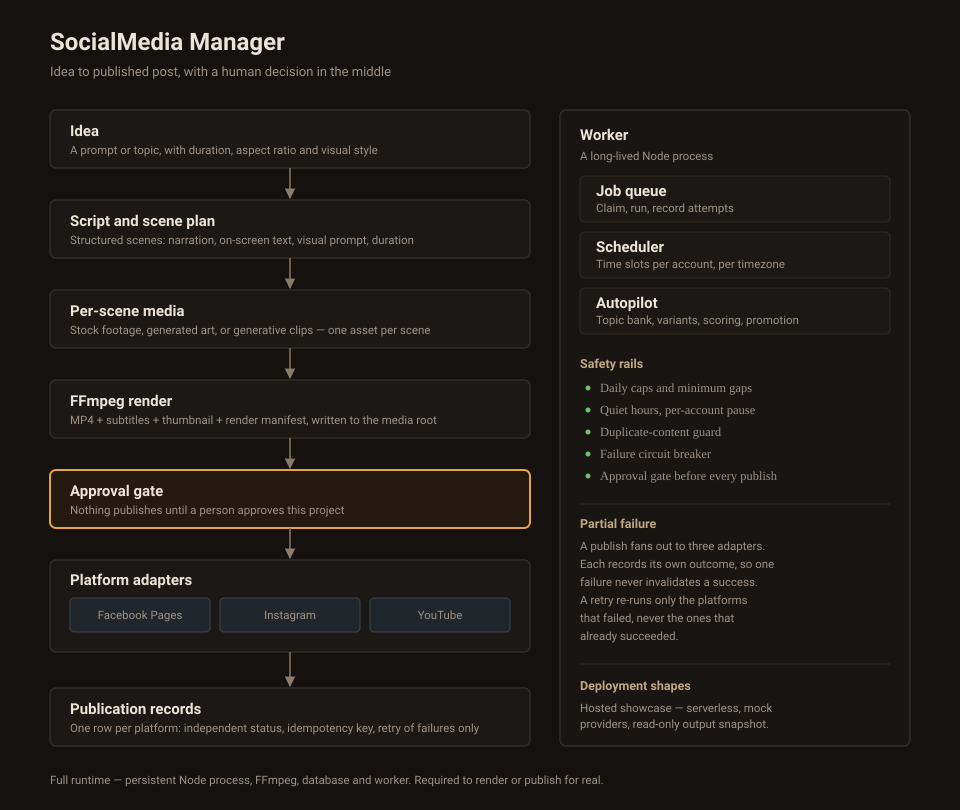

# Architecture Overview

SocialMedia Manager is organized as a local-first control room with a clear boundary between content generation, media processing, approval, and publishing.

## Flow

1. A user creates a project from an idea.
2. The generation pipeline produces structured metadata and scenes.
3. Renderers create local MP4, subtitle, thumbnail, and manifest assets.
4. The user approves the project.
5. Platform adapters publish independently and record separate outcomes.
6. Failed publications can be retried without duplicating successful platforms.
7. The worker handles queued jobs, scheduling, and guarded automation.

## Safety Model

- Publishing requires an explicit approval state.
- Platform results are isolated per publication.
- Idempotency keys prevent duplicate posts.
- Daily limits, quiet hours, account pauses, and failure circuit breakers constrain automation.
- Mock providers allow workflow testing without real credentials.

## Deployment Considerations

There are two distinct deployment shapes, and they are not interchangeable.

**The hosted showcase** (the live demo) runs as a serverless Next.js application in mock mode. It ships a read-only snapshot of real pipeline output — projects, scene plans, and the rendered MP4, thumbnail, and subtitle assets — so the review, queue, library, and topic workflows can be exercised against actual content rather than empty screens. Because the runtime filesystem is read-only and FFmpeg is not present, it cannot render new video, and writes do not survive beyond the instance that handled them.

**The full application** uses a persistent Node process, filesystem-backed media processing, a database, and a background worker. It therefore needs a persistent runtime with durable database and media storage.

### Media references are relative

Media paths are stored relative to the configured media root and resolved at read time, rather than persisted as absolute paths. This keeps a library portable: moving the project directory, or running it from a different machine, does not invalidate assets that were produced earlier.
