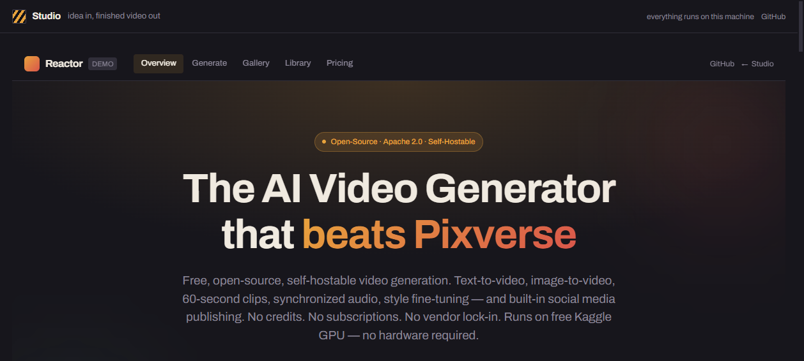
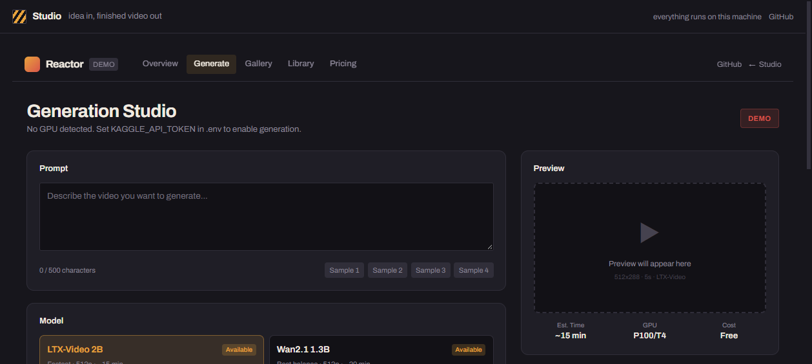
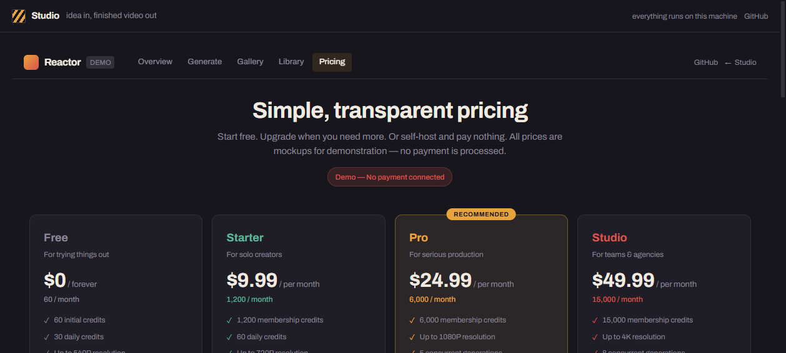

<div align="center">

# SocialMedia Manager

**A local-first video studio and publishing control room** — one idea becomes a structured script, a real rendered MP4, an approval decision, and a published post across Facebook Pages, Instagram, and YouTube, with a guarded autopilot that can grow a page on a schedule.

[](https://socialmedia-manager-eight.vercel.app)
[](#project-status)
[](#ownership)

</div>

> **This repository is a portfolio case study, not a source mirror.** The production implementation is private and proprietary. See [Ownership](#ownership).

---

## Live Demo

### ▶ [https://socialmedia-manager-eight.vercel.app](https://socialmedia-manager-eight.vercel.app)

The hosted demo runs in **safe mock mode**. No social account, credential, or signup is required: publishing adapters, OAuth flows, and the AI script provider are simulated, so the workflow can be evaluated without touching a live platform.

It is also a **showcase deployment**: it runs on a serverless platform with no persistent database, so database-backed pages report a clear "database unavailable" state instead of sample data. The full local-first application — SQLite, FFmpeg, and the background worker — runs on a persistent runtime. This boundary is deliberate and is explained in [ARCHITECTURE.md](ARCHITECTURE.md).

---

## Screenshots



| Generation studio | Pricing |
| :---: | :---: |
|  |  |

**Real pipeline output.** These vertical 1080×1920 frames were rendered by the application's own FFmpeg pipeline, including generated scene art and burned-in titles:

| Generated scene — anime style | Generated scene — underwater |
| :---: | :---: |
|  |  |

---

## Overview

SocialMedia Manager turns a content idea into a reviewable short-form video workflow: structured script, scene plan, rendered MP4, an explicit approval gate, and per-platform publishing. It is designed around **human approval and operational safety** rather than blind automation — the hard engineering problem is not generating a video, it is publishing one reliably across three APIs without duplicating posts, losing track of partial failures, or letting an autopilot run away.

The product is local-first: the studio, the database, the media pipeline, and the worker all run on one machine, and every external service is optional.

---

## Features

- **Video pipeline** — a prompt or idea becomes a structured script with scenes, then a real MP4 (1080×1920 / 1920×1080 / 1080×1080) rendered with FFmpeg, plus subtitles, a thumbnail, and a render manifest.
- **Visual styles** — anime, 3D, comic, storybook, and photoreal per-scene art, with Ken Burns motion and narration-synced subtitles. No GPU required.
- **Series mode** — a character bible with locked identity seeds keeps cast and visual style consistent across episodes, so episode 2 still looks like episode 1.
- **Cross-platform publishing** — Facebook Pages, Instagram professional accounts (Reels), and YouTube resumable upload, each with independent results and a partial-failure rollup.
- **Autopilot growth engine** — topic bank → variant generation → scoring → promotion → content queue → scheduled publishing, in modes from `off` through `suggest_only` and `review_required` up to `full_auto`.
- **Safety rails** — daily caps, minimum gaps, quiet hours, per-account pause switches, a duplicate-content guard, a failure circuit breaker, and an approval gate before every publish.
- **Mock mode** — the entire workflow runs with zero credentials, including simulated publishing failures so retry logic can be exercised deliberately.

---

## Technology

- **Application:** Next.js 15, React 19, TypeScript
- **Data:** Prisma ORM over SQLite for the local-first runtime
- **Media:** FFmpeg and ffprobe, filesystem media storage, SRT subtitle generation
- **Integrations:** Meta Graph API (Facebook Pages, Instagram professional), YouTube Data API, optional generative-video and stock-footage providers
- **Operations:** a Node.js worker process for jobs, scheduling, and guarded automation
- **Testing:** Vitest, including a real FFmpeg render and publish-orchestration tests

---

## Architecture

```text
Idea
  -> script and scene generation
  -> per-scene media assets (art / stock / generated clips)
  -> FFmpeg render  ->  MP4 + subtitles + thumbnail + manifest
  -> approval gate
  -> platform adapters (Facebook Pages | Instagram | YouTube)
  -> independent publication records + partial-failure retry
```

A single worker owns jobs, the scheduler, and the autopilot. Publishing is modelled as explicit state transitions with one record per platform, so a failure on one platform never invalidates a success on another.

See [ARCHITECTURE.md](ARCHITECTURE.md) for the full breakdown, including the safety model.

---

## Technical Highlights

- **Partial-failure publishing.** A publish action fans out to three independent platform adapters. Each records its own outcome, and a retry re-runs only the platforms that failed — never the ones that already succeeded.
- **Idempotency keys per publication.** Every publish attempt carries an idempotency key, so a retry after a timeout cannot produce a duplicate post.
- **A mock provider suite as a first-class citizen.** The same interfaces are backed by mock implementations that can simulate success, failure, and slow responses. This is what makes the publishing paths testable without live accounts, and it is why the public demo can be honest about running in mock mode.
- **Real rendering under test.** The test suite renders an actual 1080×1920 MP4 rather than asserting against a stub, so the media pipeline cannot silently regress.
- **Guarded automation.** The autopilot is constrained by daily caps, minimum gaps, quiet hours, account pauses, a duplicate-content guard, and a circuit breaker — automation is opt-in at every level.

---

## Deployment

The public demo is deployed on **Vercel** as a Next.js application, running in mock mode with no external credentials configured.

The complete application is designed for a persistent runtime: a long-lived Node process, filesystem-backed media processing, a database, and a background worker. A serverless frontend-only deployment is intentionally a demonstration surface, not a substitute for the full production runtime — which is why the hosted demo is scoped to the review workflow and mock providers.

---

## Project Status

**Active development.** The local production build and test suite are verified, and the public mock-mode demo is live on Vercel. Persistent production publishing infrastructure is deliberately kept separate from the portfolio demo.

---

## Ownership

Built by **Flamur** ([@ulasmango-cmd](https://github.com/ulasmango-cmd)).

- GitHub profile: [github.com/ulasmango-cmd](https://github.com/ulasmango-cmd)
- Live demo: [socialmedia-manager-eight.vercel.app](https://socialmedia-manager-eight.vercel.app)
- Private production source: [ulasmango-cmd/socialmedia-manager-source](https://github.com/ulasmango-cmd/socialmedia-manager-source) *(private)*

---

## License

All rights reserved — see [LICENSE](LICENSE).

The production implementation is private and proprietary. This repository contains documentation, screenshots, and project presentation material only.
